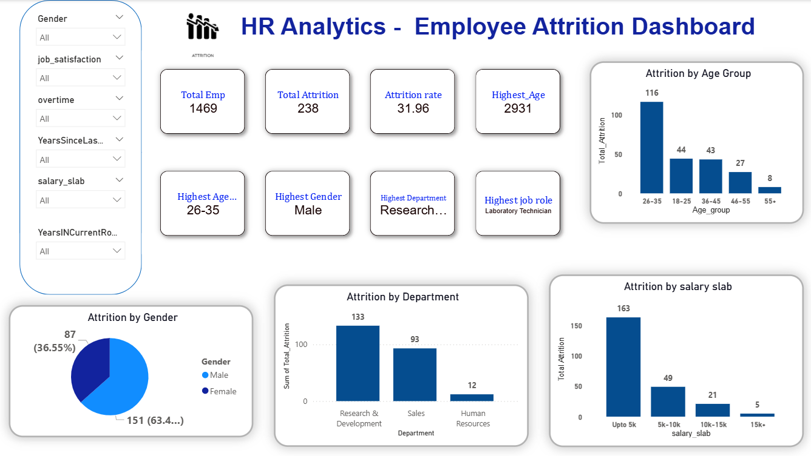
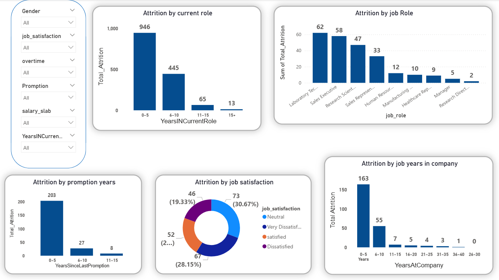

# HR Analytics - Employee Attrition Dashboard

  
  
  

## 1. Project Overview
This project analyses employee attrition data to identify key factors influencing employee turnover, such as age, gender, department, salary, job role, job satisfaction, and career growth patterns. The goal is to understand why employees leave the company and provide data-driven insights to improve employee retention and support better HR decision-making.

## 2. Key Metrics 
Age group vs attrition
Gender vs attrition rate
dept vs attrition
salary vs attrition
years in current role vs attrition
Job Role vs Attrition
job satisfaction vs attrition
promotion vs attrition
years in company vs attrition

## 3. Dataset
- **Source:** Kaggle  
- **Total Records:** 15k
- **Columns:** 38 

## 4. Tools & Technologies
- **sql:** Data cleaning & analysis.
- **Power BI:** Dashboard development & visualization.

## 5. Data Cleaning Steps
- checking duplicate (Emp_id-wise or row-wise).
- checking null values and handling them(using the collesce function).
- Data type change
- Perform data transformation  mtlb jaise mne col m values ko chace kiya h jaise maan lo years at company col m 0-5 jha jha likha h usko mne "0-5y" kr diya . is tyoe se kiya h to isko kya likhe. 
 

## 6. Dataset Links
- **Dataset:** [Download CSV](https://github.com/Krishbelwal/HR-Analytics---Employee-Attrition-Dashboard/blob/main/Dataset.csv)  

## 7. Dashboard Previews
- **Content Type Overview:** [View Dashboard](https://github.com/Krishbelwal/Netflix_Content_Analysis/blob/main/Netfllix%20Content%20Type%20overview.png)   

## 8. Project Workflow
1. **Data Import:** Imported Excel dataset from Kaggle.  
2. **Understand Business Problem** Analysed strategic content planning needs.  
3. **Define Key Metrics & KPIs:** Total shows, movies vs TV shows, top genres, top countries, YoY trends, and more.  
4. **Data Cleaning & Transformation:** Cleaned data in Excel and Power Query.  
5. **Data Analysis:** Used pivot tables and charts in Excel to identify patterns and trends.  
6. **Power BI Import:** Imported cleaned data for visualisation.  
7. **DAX Measures:** Created measures like Total Shows, Total Movies, Total TV Shows, YoY Growth, and Top Countries.  
8. **Dashboard Development:** Built interactive dashboards with charts, tables, slicers, and KPIs.  
9. **Insights & Recommendations:** Derived actionable insights to support business decisions.  

## 9. Key Insights & Business Recommendations

**1. Popular Content**  
- Netflix has a total of **24,000 shows**, with **Movies making up 71% and TV Shows 29%**.  
- This shows that movies dominate, so Netflix could **focus more on TV shows to increase long-term user engagement**.  

**2. Top Producing Countries**  
- The **USA leads with ~6,700 shows** around 42%.  
- This indicates strong production in the US, but Netflix can **invest more in India and the UK to attract more and user subscribers**.  

**3. Popular Genres**  
- The most popular genres are **International Movies and Dramas**, which have the highest number of shows.  
- Netflix could **also explore other genres** to diversify content and reach different audiences.  

**4. Content Trends**  
- The year-over-year content growth has been **fluctuating**, with some years higher and others lower.  
- This suggests that Netflix should **plan content production more strategically** to maintain consistent growth.  

**5. Ratings Distribution**  
- Most content is targeted toward **general and teen audiences (TV-MA, TV-14)**.  
- Since International Movies are most popular among these ratings, Netflix can **focus on producing content in this genre to attract and retain teen viewers**.  

